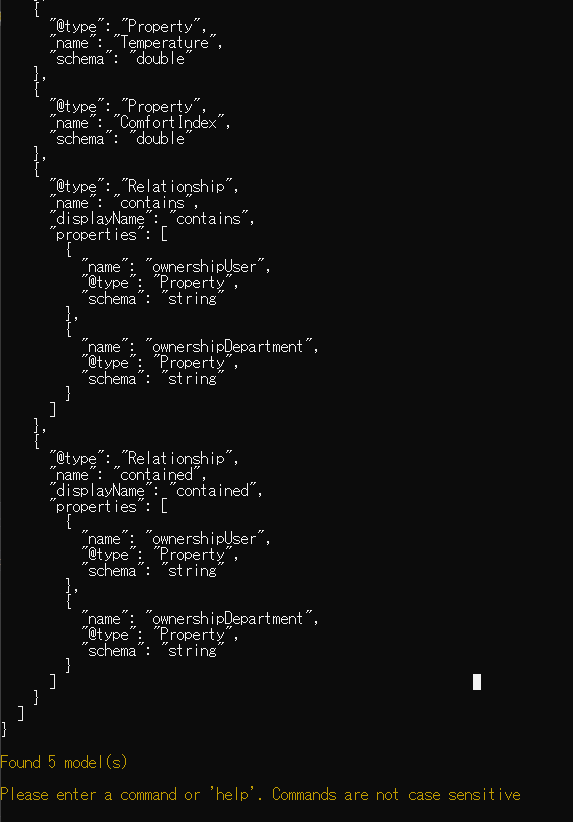

# Azure-Digital-Twins-Tutorials
## Step02
### サンプルクライアントアプリを使用してAzure Digital Twinsを試す

公式手順：https://docs.microsoft.com/ja-jp/azure/digital-twins/tutorial-command-line-app


1. 事前準備
    - Visual Studio 2019 16.5以降をインストール
    - Azure Digital Twins インスタンス（Step01参照）
    - サンプルプログラム(Azure Digital Twins samples)
      - https://docs.microsoft.com/ja-jp/samples/azure-samples/digital-twins-samples/digital-twins-samples/


2. サンプルプロジェクトにテナントID,クライアントID,ADTホスト名をセット
    - serviceCongig.json

3. DTDLを使用して物理環境をモデル化する
    1. ツインモデルの更新  
        1. Room.json
            - バージョン番号の更新
            - HumidityをHumidityLevelに変更
            - RoomNameプロパティの追加
            - リレーションシップを追加
            ```
            {
                "@id": "dtmi:example:Room;2",
                "@type": "Interface",
                "displayName": "Room",
                "contents": [
                    {
                        "@type": "Property",
                        "name": "Temperature",
                        "schema": "double"
                    },
                    {
                        "@type": "Property",
                        "name": "HumidityLevel",
                        "schema": "double"
                    },
                    {
                        "@type": "Property",
                        "name": "RoomName",
                        "schema": "string"
                    },
                    {
                        "@type": "Relationship",
                        "name": "contains"
                    }

                ],
                "@context": "dtmi:dtdl:context;2"
            }

            ```

        2. Floor.json
            ```
            {
                "@id": "dtmi:example:Floor;1",
                "@type": "Interface",
                "displayName": "Floor",
                "@context": "dtmi:dtdl:context;2",
                "contents": [
                    {
                        "@type": "Relationship",
                        "name": "contains",
                        "displayName": "contains",
                        "properties": [
                            {
                                "name": "ownershipUser",
                                "@type":"Property",
                                "schema": "string"
                            },
                            {
                                "name": "ownershipDepartment",
                                "@type":"Property",
                                "schema": "string"
                            }
                        ]
                    }
                ]
            }

        3. ThermostatModel.json
            ```
            {
                "@id": "dtmi:contosocom:DigitalTwins:Thermostat;1",
                "@type": "Interface",
                "displayName": "Thermostat interface model",
                "@context": "dtmi:dtdl:context;2",
                "contents": [
                    {
                        "@type": "Property",
                        "name": "DisplayName",
                        "schema": "string"
                    },
                    {
                        "@type": "Property",
                        "name": "Location",
                        "schema": "string"
                    },
                    {
                        "@type": "Property",
                        "name": "FirmwareVersion",
                        "schema": "string"
                    },
                    {
                        "@type": "Property",
                        "name": "Temperature",
                        "schema": "double"
                    },
                    {
                        "@type": "Property",
                        "name": "ComfortIndex",
                        "schema": "double"
                    },
                    {
                        "@type": "Relationship",
                        "name": "contains",
                        "displayName": "contains",
                        "properties": [
                            {
                                "name": "ownershipUser",
                                "@type": "Property",
                                "schema": "string"
                            },
                            {
                                "name": "ownershipDepartment",
                                "@type": "Property",
                                "schema": "string"
                            }
                        ]
                    },
                    {
                        "@type": "Relationship",
                        "name": "serves",
                        "displayName": "serves",
                        "properties": [
                            {
                                "name": "ownershipUser",
                                "@type": "Property",
                                "schema": "string"
                            },
                            {
                                "name": "ownershipDepartment",
                                "@type": "Property",
                                "schema": "string"
                            }
                        ]
                    }
                ]
            }
            ```

            4. SpaceModel.json
            ```
            {
                "@id": "dtmi:contosocom:DigitalTwins:Space;1",
                "@type": "Interface",
                "displayName": "Space interface model",
                "@context": "dtmi:dtdl:context;2",
                "contents": [
                    {
                        "@type": "Property",
                        "name": "DisplayName",
                        "schema": "string"
                    },
                    {
                        "@type": "Property",
                        "name": "Location",
                        "schema": "string"
                    },
                    {
                        "@type": "Property",
                        "name": "Temperature",
                        "schema": "double"
                    },
                    {
                        "@type": "Property",
                        "name": "ComfortIndex",
                        "schema": "double"
                    },
                    {
                        "@type": "Relationship",
                        "name": "contains",
                        "displayName": "contains",
                        "properties": [
                            {
                                "name": "ownershipUser",
                                "@type": "Property",
                                "schema": "string"
                            },
                            {
                                "name": "ownershipDepartment",
                                "@type": "Property",
                                "schema": "string"
                            }
                        ]
                    },
                    {
                        "@type": "Relationship",
                        "name": "contained",
                        "displayName": "contained",
                        "properties": [
                            {
                                "name": "ownershipUser",
                                "@type": "Property",
                                "schema": "string"
                            },
                            {
                                "name": "ownershipDepartment",
                                "@type": "Property",
                                "schema": "string"
                            }
                        ]
                    }
                ]
            }   
            ```
4. サンプルアプリの実行
    1. Visual Studio 2019 から実行
       - help command
    

    2. モデルのアップロード(すでに存在する場合エラー)
        ```
        CreateModels Room Floow
        ```
        

    3. モデルの確認
        ```
        GetModels true
        ```
        
        
        
        

    4. モデルの削除(参考)
        - Azure Digital Twins のモデルを管理する
            - https://docs.microsoft.com/ja-jp/azure/digital-twins/how-to-manage-model

    5. デジタルツインを作成する
        ```
        CreateDigitalTwin dtmi:example:Room;2 room0 RoomName string Room0 Temperature double 70 HumidityLevel double 30
        CreateDigitalTwin dtmi:example:Room;2 room1 RoomName string Room1 Temperature double 80 HumidityLevel double 60
        CreateDigitalTwin dtmi:example:Floor;1 floor0
        CreateDigitalTwin dtmi:example:Floor;1 floor1
        ```
        


    6. デジタルツインを確認する
        ```
        Query 'SELECT * FROM DIGITAL TWINS'
        ```

    7. デジタルツインに変更を加える
        ```
        UpdateDigitalTwin room0 add /RoomName string PresidentialSuite
        GetDigitalTwin room0
        ```
        
        
    8. リレーションシップを追加してグラフを作成する
        - FloorツインからRoomツインへのContainsリレーションシップを追加
            ```
            CreateRelationship floor0 contains room0 relationship0
            CreateRelationship floor1 contains room1 relationship1
            ```

    9. リレーションシップの確認
        - 各フロアを接続元とするすべてのリレーションシップ
            ```
            GetRelationships floor0
            GetRelationships floor1
            ```
            

        - 各部屋を接続先とするすべてのリレーションシップ
            ```
            GetIncomingRelationships room0
            ```
            

        - リレーションシップを個別に紹介
            ‘‘‘
            GetRelationship floor0 contains relationship0
            GetRelationship floor1 contains relationship1
            ‘‘‘
            


        - 概念グラフ
            

    10. 環境についての質問をツイングラフに照会する
        
        Azure　Digital Twinsの主な機能は、環境についての質問に答えるクエリをツイングラフに対して用意にかつ効率よく実行できることである

        1. Azure Digital Twinsで表されている環境内のすべてのエンティティを知りたい（すべて照会）
            ```
            Query
            ```
            - 引数が追加されていないQueryコマンドは、Query SELECT * FROM DIGITALTWINSとなる

            

        2. 環境内に存在する部屋をすべて知りたい (モデルで照会)
            ```
            Query SELECT * FROM DIGITALTWINS T WHERE IS_OF_MODEL(T, 'dtmi:example:Room;2')
            ```
            

        3. floor0 に存在するすべての部屋を知りたい (リレーションシップで照会)
            ```
            Query SELECT room FROM DIGITALTWINS floor JOIN room RELATED floor.contains where floor.$dtId = 'floor0'
            ```
            

        4. 自分の環境に存在するツインのうち、温度が 75 度を超えるツインをすべて知りたい (プロパティで照会)
            ```
            Query SELECT * FROM DigitalTwins T WHERE T.Temperature > 75
            ```
            

        5.  floor0 上で温度が 75 度を超えるすべての部屋を知りたい (複合クエリ)
            ```
            Query SELECT room FROM DIGITALTWINS floor JOIN room RELATED floor.contains where floor.$dtId = 'floor0' AND IS_OF_MODEL(room, 'dtmi:example:Room;2') AND room.Temperature > 75
            ```
            

            


### Step02 Completed！