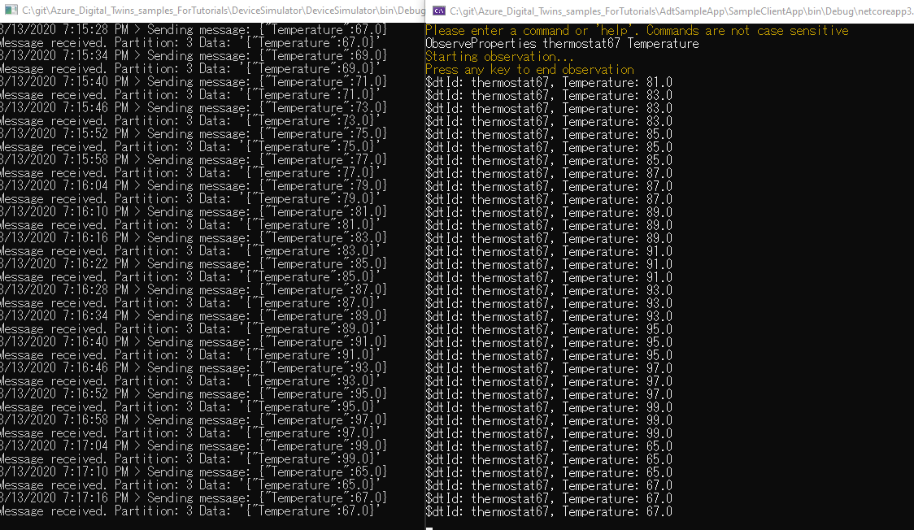
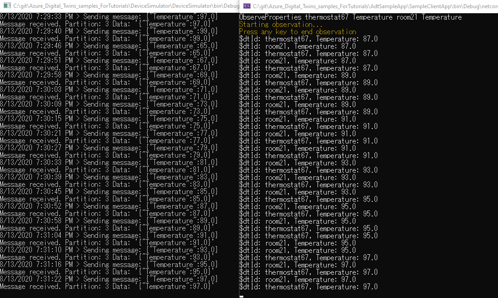

# Azure-Digital-Twins-Tutorials
## Step03
### エンドToエンドのソリューションを接続する

公式手順：https://docs.microsoft.com/ja-jp/azure/digital-twins/tutorial-end-to-end

1. 事前準備
    - Visual Studio 2019 16.5以降をインストール
    - Azure Digital Twins インスタンス（Step01参照）
    - サンプルプログラム(Azure Digital Twins samples)(Step02参照)
      - https://docs.microsoft.com/ja-jp/samples/azure-samples/digital-twins-samples/digital-twins-samples/

2. Cloud Shell セッションの設定
    - 下記公式手順に従い実施
        - https://docs.microsoft.com/ja-jp/azure/digital-twins/tutorial-end-to-end#set-up-cloud-shell-session

3. サンプルプログラムの設定
    - 下記公式手順に従い実施
        - https://docs.microsoft.com/ja-jp/azure/digital-twins/tutorial-end-to-end#configure-the-sample-project

4. ビルディングシナリオの概要の理解
    - 公式手順
        - https://docs.microsoft.com/ja-jp/azure/digital-twins/tutorial-end-to-end#get-started-with-the-building-scenario
    
    - 概念図
        

        - セクションA
            - Azure Digital Twinsの構成
        - セクションB
            - IoTHubからADTへのデータ送信
        - セクションC  
            - ツイングラフへのデータ反映

5. 事前に作成されたツイングラフをインスタンス化する
    - 公式手順
        - https://docs.microsoft.com/ja-jp/azure/digital-twins/tutorial-end-to-end#instantiate-the-pre-created-twin-graph
    
    1. AdtE2ESampleの実行
    2. SetupBuildingScenarioの実行
    3. Qeryを実行してfoloor1, room21, thermostat67を確認

6. Functionsアプリの構成
    - 公式手順に従って、アプリを発行する
        - https://docs.microsoft.com/ja-jp/azure/digital-twins/tutorial-end-to-end#publish-the-app

            1. ProcessHubToDTEvents
                - IoTHubからのデータを処理し、Azure Digital Twinsを更新
            2. ProcessDTRoutedData
                - Azure Digital Twinsからのデータを処理し、Azure Digital Twins内の親ツインを更新

    - 公式手順に従って、Functionsアプリにアクセス許可を割り当て
        - https://docs.microsoft.com/ja-jp/azure/digital-twins/tutorial-end-to-end#assign-permissions-to-the-function-app


7. IoTHubデバイスからのテレメトリを処理する
    - 公式手順に従って、IoTHubを作成し、Functionsアプリに接続する
        - https://docs.microsoft.com/ja-jp/azure/digital-twins/tutorial-end-to-end#process-simulated-telemetry-from-an-iot-hub-device

    1. IoTHubの作成
    2. 統合EventGridを利用して、ProcessHubtoDTEventsと接続（EventGridTrigger)
    3. シミュレートされたデバイスをIoTHubに塘路億
        - デバイスＩＤ: thermostat67
        - <span style="color: red; ">これがAzure Digital Twinsで紐づけられる？？？</span>
    4. サンプルに含まれるDevice Simulatorを実行
        - AzureIoTHub.csにサービス接続文字列、デバイス接続文字列をセット
    5. Device Simulatorを実行

8. Azure Digital Twinsで結果を確認する(セクションＢ)
    - AdtE2ESampleで、下記のコマンドを実行し、Azure Digital Twinsのデジタルツインthermostat67からレポートされる温度を取得する
        ```
        ObserveProperties thermostat67 Temperature
        ```
    

9. Azure Digital Twinsのイベントをグラフ全体に反映させる（セクションＣ）
    - 公式手順に従って、IoTHubを作成し、Functionsアプリに接続する
        - https://docs.microsoft.com/ja-jp/azure/digital-twins/tutorial-end-to-end#propagate-azure-digital-twins-events-through-the-graph

    1. EventGridトピックの作成
    2. Azure Digital TwinsとEventGridトピックを接続
        ```
        az dt endpoint create eventgrid --dt-name <your-Azure-Digital-Twins-instance> --eventgrid-resource-group <your-resource-group> --eventgrid-topic <your-event-grid-topic> --endpoint-name <name-for-your-Azure-Digital-Twins-endpoint>
        ```
        結果確認
        ```
        az dt endpoint show --dt-name <your-Azure-Digital-Twins-instance> --endpoint-name <your-Azure-Digital-Twins-endpoint>
        ```
        
    3. Azure Digital Twinsエンドポイントにイベントを送信するAzure Digital Twinsルートを作成する
        ```
        az dt route create --dt-name <your-Azure-Digital-Twins-instance> --endpoint-name <your-Azure-Digital-Twins-endpoint> --route-name <name-for-your-Azure-Digital-Twins-route>
        ```
    4. EventGridを作成し、呼び出す関数を設定する(EventGridTrigger)
        * この関数がroom21ツインを更新する
    5. サンプルに含まれるDevice Simulatorを実行する
        
    


### Step03 Completed！